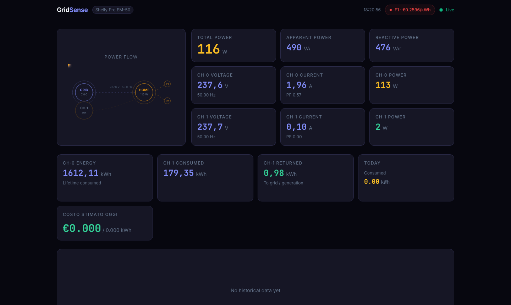

# GridSense

**Self-hosted IoT energy intelligence platform** for the Shelly Pro EM-50 smart meter.

GridSense goes beyond device monitoring: it ingests raw electrical measurements at 5-second resolution, stores them in a time-series database, and delivers real-time insights through a modern dashboard — animated power flow, energy cost tracking, statistical anomaly detection, and a dark/light theme toggle. A natural-language AI assistant is on the roadmap.

→ [Architecture & design decisions](docs/architecture.md)



---

## Stack

| Layer | Technology |
|-------|-----------|
| Runtime | [Bun](https://bun.sh) |
| HTTP & WebSocket | [Hono](https://hono.dev) |
| Real-time bus | Redis 7 (pub/sub) |
| Message broker | Mosquitto 2 (MQTT) |
| Database | [TimescaleDB](https://www.timescale.com) — PostgreSQL 16 + time-series engine |
| ORM / schema | [Drizzle ORM](https://orm.drizzle.team) |
| Frontend | [Next.js 15](https://nextjs.org) · React 19 · Tailwind CSS v4 |
| Animations | [Framer Motion](https://www.framer.com/motion/) |
| Charts | [Recharts](https://recharts.org) |
| E2E tests | [Playwright](https://playwright.dev) |
| Containerisation | Docker Compose |

---

## Architecture

```
Shelly Pro EM-50
      │ MQTT (preferred) / HTTP RPC fallback
      ▼
  collector ──► TimescaleDB (em_readings hypertable)
      │              └─ anomalies hypertable (spike / night_load / sustained_high)
      └──► Redis pub/sub ──► api WebSocket ──► browser
                               │
                               └── REST API (history, energy, cost, anomalies)
```

Full diagram and design rationale: [docs/architecture.md](docs/architecture.md)

---

## Getting started

### Prerequisites
- Docker + Docker Compose
- Shelly Pro EM-50 reachable on the local network

### Run

```bash
cp .env.example .env
# Edit .env — set SHELLY_HOST to your device's IP (default: 192.168.1.6)

docker compose up --build
```

TimescaleDB initialises automatically on first start (hypertable, 1-minute continuous aggregate, 90-day retention policy).

### Endpoints

| URL | Description |
|-----|-------------|
| `http://localhost:3002` | Web dashboard |
| `http://localhost:3000/api/live` | Current reading direct from Shelly |
| `http://localhost:3000/api/energy/today` | Today's consumption |
| `http://localhost:3000/api/energy/consumption?period=day` | Consumption per day/month/year |
| `http://localhost:3000/api/readings/history?from=…` | Historical time-series |
| `http://localhost:3000/api/cost/today` | Today's cost by tariff band (F1/F2/F3) |
| `http://localhost:3000/api/anomalies` | Recent anomaly events |
| `http://localhost:3000/api/anomalies/summary` | Anomaly counts (last 24 h) |
| `ws://localhost:3000/ws` | Real-time WebSocket stream |
| `http://localhost:3001/health` | Collector health |

---

## API reference

### `GET /api/readings/history`

| Param | Type | Default | Description |
|-------|------|---------|-------------|
| `from` | ISO 8601 | required | Start of window |
| `to` | ISO 8601 | now | End of window |
| `channel` | `0` \| `1` | both | Filter by channel |
| `resolution` | `5s` \| `1m` \| `5m` \| `15m` \| `1h` | auto | Time bucket size |

### `GET /api/energy/consumption`

| Param | Type | Default | Description |
|-------|------|---------|-------------|
| `period` | `day` \| `month` \| `year` | `day` | Bucket granularity |
| `from` | ISO 8601 | 30 d / 12 m / 5 y ago | Start of window |
| `to` | ISO 8601 | now | End of window |

Returns `{ data: [{ period, ch0Wh, ch1Wh, totalWh }], meta }` — max-min counter diff per bucket, same semantics as an electricity meter.

### `GET /api/energy/delta`

Returns energy consumed and returned (Wh) between two timestamps using the device's cumulative counter.

### `GET /api/cost/today` · `GET /api/cost/breakdown`

Energy cost in euros broken down by Italian tariff band (F1/F2/F3, Europe/Rome timezone). Rate config via `TARIFF_F1_EUR_KWH`, `TARIFF_F2_EUR_KWH`, `TARIFF_F3_EUR_KWH` env vars.

### `GET /api/anomalies`

| Param | Type | Default | Description |
|-------|------|---------|-------------|
| `from` | ISO 8601 | last 24 h | Start of window |
| `type` | `spike` \| `night_load` \| `sustained_high` | all | Filter by type |
| `channel` | `0` \| `1` | both | Filter by channel |
| `limit` | number | 50 (max 500) | Max results |

### `WS /ws`

Pushes a `LiveReadingsEvent` JSON frame every ~5s (collector poll interval). Send `"ping"` to receive `"pong"` for keepalive checking.

---

## E2E tests

```bash
# Start the full stack
docker compose up -d

# Run Playwright tests (requires Node on host for the test runner)
cd apps/web
npx playwright install --with-deps chromium
npx playwright test
```

Reports are generated in `apps/web/playwright-report/`.

---

## Monorepo layout

```
gridsense/
├── apps/
│   ├── collector/          Poll loop (MQTT/HTTP) — reads Shelly, writes DB + Redis
│   ├── api/                REST API + WebSocket (Hono)
│   └── web/                Next.js 15 dashboard + Playwright E2E
├── packages/
│   ├── shelly-client/      Typed HTTP client for Shelly Gen2 RPC API
│   ├── db/                 Drizzle schema + TimescaleDB migrations
│   ├── events/             Redis pub/sub types, publisher, subscriber
│   ├── tariff/             Italian F1/F2/F3 tariff-band classifier
│   └── anomaly/            Statistical anomaly detector (spike / night_load / sustained_high)
├── infra/
│   └── mosquitto/          Mosquitto MQTT broker config
├── docs/
│   └── architecture.md     System design & decisions
└── docker-compose.yml
```

---

## Roadmap

- [x] Data acquisition — Shelly MQTT + HTTP polling fallback → TimescaleDB
- [x] REST API — historical queries, energy delta, consumption per period, live endpoint
- [x] Real-time — Redis pub/sub → WebSocket → dashboard
- [x] Web dashboard — power flow, live metrics, 1h chart, consumption bar chart, dark/light theme
- [x] Tariff engine — Italian F1/F2/F3 time-of-use cost calculation
- [x] Anomaly detection — statistical spike detection, night load alerts, sustained high load
- [ ] Demand forecasting — pattern-based next-hour prediction
- [ ] AI assistant — natural language queries on consumption data

## License

MIT
